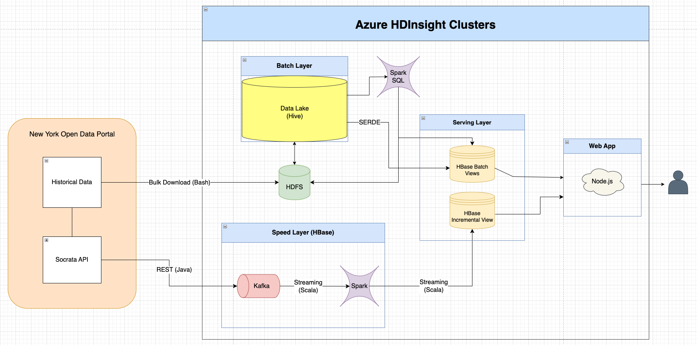
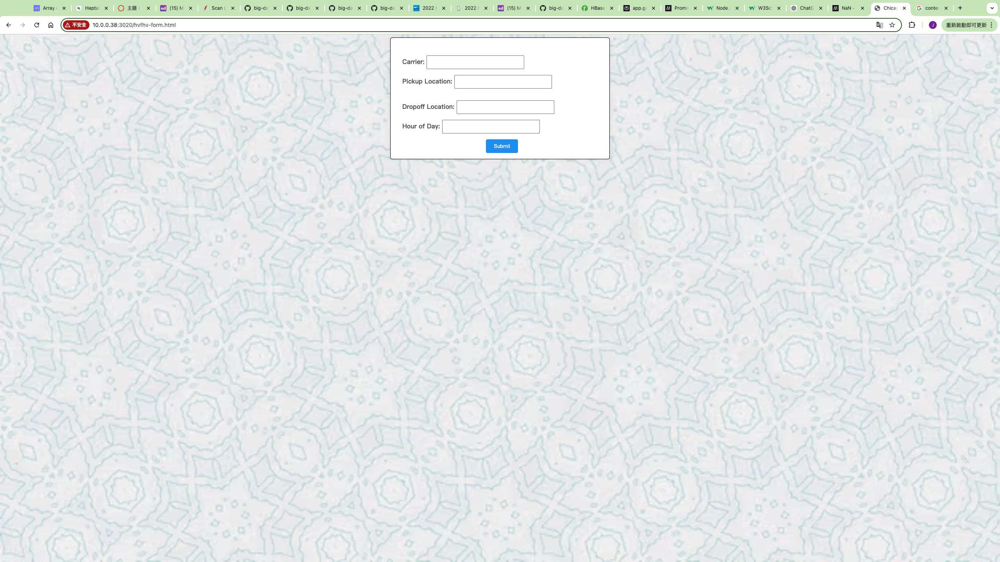

## End-to-End Lambda Architecture for Ad Hoc Reporting on Large-Scale Uber Trip Data


This project implements the Lambda Architecture to analyze high-volume for-hire vehicle (HVFHV) trips in New York City. It provides insights into key metrics such as average price, waiting time, trip duration, and the costs associated with tolls and congestion surcharges. These metrics are broken down by carrier, pickup location, dropoff location, and hour of the day.

The primary purpose of this project is to establish an ad hoc reporting system that enables the analysis of trip efficiency and pricing dynamics for major ride-sharing services in the United States. This project was developed as the final assignment for MPCS53014 - Big Data Application Architecture at the University of Chicago. 


## Structure


1. `Batch Layer`: This layer manages the master dataset, which serves as the source of truth. It consists of an immutable, append-only set of raw data. The batch layer pre-computes views from this master dataset.

2. `Serving Layer`: This layer responds to ad-hoc queries by returning pre-computed views from the batch layer or building views from the processed data. It combines batch views and incremental views, which are ad-hoc queries requested from the web application.

3. `Speed Layer`: This layer deals exclusively with up-to-date data to compensate for the latency inherent in the batch layer. It ensures that recent data is quickly incorporated into the system's outputs.

In addition to these three layers, the project utilizes a front-end web application to convert the output into a graphical interface, making the data more accessible and user-friendly.


#### Batch Layer

The batch layer stores the master datasets `jycchien_fhv_tripdata` and `jycchien_zone_lookup` in HDFS hosted in Azure HDInsight Clusters. 
It ingests the raw historical data through [ingest_fhv_data.sh](batch_layer/ingest_fhv_data.sh) and [get_zone_lookup.sh](batch_layer/get_zone_lookup.sh). Then, [the layer](batch_layer) creates Hive tables containg the raw csv data. These are then copied and stored in ORC file format.

#### Serving Layer

The serving layer takes the ORC tables in Hive and populates derived tables into HBase by utilizing a [spark script](serving_layer/hvfhs_route_hourly.scala) to perform data wranggling against the master datasets. `jycchien_hvfhs_trip` serve as a staging table to generate the batch view `jycchien_hvfhs_route_hourly`, which is then stored in HBase as `jycchien_hvfhs_route_hourly_summary`.
On the other hand, the serving layer also create tables in HBase to handle Ad-Hoc querying. The spark script create 3 Hbase tables: `jycchien_carrier, jycchien_zone, jycchien_hours` for the front-end app to scan these tables and build a searchable drop-down list for users to submit their ad-hoc queries. 

#### Speed Layer

The speed layer consists of two steps: writing incoming json data into Kafka, and reading from the Kafka message to update the batch view.

 - [`kafka-trip`](speed_layer/kafka-trip/src/main/java/org/example) implements a Kafka streaming buffer by getting real-time trip data through the Socrata Open Data API. It utilizes Java POJO to hold the incoming trip json data and publish it to Kafka topic called `jycchien_hvhfv`.
 - [`tripSpeedLayer`](https://github.com/jycc-267/big-data-hvfhv-uber/tree/main/speed_layer/tripSpeedLayer/src/main/scala) consumes the real-time trip messages from Kafka and extracts the attributes required, and increments the processed data for the Speed Layer HBase table `jycchien_hvfhs_route_hourly_summary_speed`.
 - In order to get the row key of `jycchien_hvfhs_route_hourly_summary_speed`, `tripSpeedLayer` has to concat attributes retrieved from POJO: (`$carrierValue|$pickupZoneName|$dropoffZoneName|$hourInDay`). Since these four attributes are also user inputs, the front-end endpoints can avoid `scanning` against large batch and speed views by easily concatenating user inouts to get the row key.
 - By doing so, the system saves compute power and reduce database I/Os.

## Data

The dataset taken from the City of New York's open data portal:
- [2022 High Volume FHV Trip Records](https://data.cityofnewyork.us/Transportation/2022-High-Volume-FHV-Trip-Records/g6pj-fsah/about_data)
- [NYC Taxi Zones Open Dataset](https://d37ci6vzurychx.cloudfront.net/misc/taxi_zone_lookup.csv)

These records are generated from trip record submissions made by High Volume For-Hire Vehicle (FHV) bases. These bases are TLC-licensed FHV businesses that currently dispatch, or plan to dispatch, more than 10,000 FHV trips per day in New York City under a single brand, trade, or operating name. These services are referred to as High-Volume For-Hire Services (HVFHS).

Each row in the High Volume FHV Trip Records represents a single trip in an FHV dispatched by a high-volume base. The trip records include fields that capture:

1. The high-volume license number
2. The pickup date and time
3. The dropoff date and time
4. The pickup location ID (corresponding to NYC Taxi Zones)
5. The dropoff location ID (corresponding to NYC Taxi Zones)

#### Data Management:
- The master datasets in the batch layer were exported in CSV format and bulk downloaded.
- The real-time incoming dataset retrieves current data through the Socrata Open Data API, specifically targeting the 2022 High Volume FHV Trip Records.
- This real-time data (10,000 records per batch) is fetched at 10-second intervals and processed at 5-second intervals, ensuring that the system has access to up-to-date information.

## Run the Web App

```bash
# Run Kafka Trip Update
sshuser@hn0-hbase:~/jycchien/kafka-trip/target$ java -cp uber-kafka-trip-1.0-SNAPSHOT.jar org.example.TripUpdate $KAFKABROKERS

# Run Spark Streaming Job
sshuser@hn0-hbase:~/jycchien/tripSpeedLayer/target$ spark-submit --master local[2] --driver-java-options "-Dlog4j.configuration=file:///home/hadoop/ss.log4j.properties" --class StreamTrips uber-tripSpeedLayer-1.0-SNAPSHOT.jar $KAFKABROKERS

# SSH Tunneling
ssh -i <my public key> -C2qTnNf -D 9876 sshuser@hbase-mpcs53014-2024-ssh.azurehdinsight.net

# SSH Connection
ssh -i <my public key> sshuser@hbase-mpcs53014-2024-ssh.azurehdinsight.net

# Install Node.js dependencies
sshuser@hn0-hbase:~/jycchien/fhv_webapp$ npm install

# Run Node.js application
sshuser@hn0-hbase:~/jycchien/fhv_webapp$ node app.js 3012 http://10.0.0.26:8090 $KAFKABROKERS
```
The [Node.js web application](webapp) allows users to select riding service provider, pickup location, dropoff location, and hour in day from 4 drop-down lists. It shows the current average trip metrics for each hourly route specified.


## Demo

Demo Video: 

https://youtu.be/pzD_eoVlbF0

Before submitting:



After submitting:


