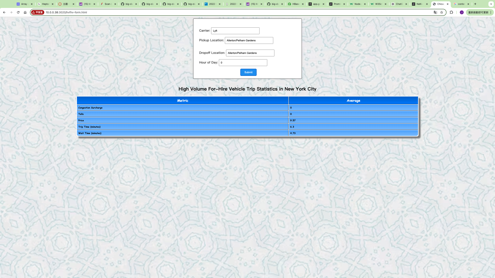

## New York City High Volumn For-Hire Vehicle (hvfhv) Reporting

http://10.0.0.38:<port_number>/hvfhv-form.html

This project implements the Lambda Architecture to analyze high-volume for-hire vehicle (HVFHV) trips in New York City. It provides insights into key metrics such as average price, waiting time, trip duration, and the costs associated with tolls and congestion surcharges. These metrics are broken down by carrier, pickup location, dropoff location, and hour of the day.

The primary purpose of this project is to establish an ad hoc reporting system that enables the analysis of trip efficiency and pricing dynamics for major ride-sharing services in the United States. By leveraging the Lambda Architecture, the system can process both batch and real-time data, offering a comprehensive view of the ride-sharing landscape in New York City.

This project was developed as the final assignment for MPCS53014 - Big Data Application Architecture at the University of Chicago. 

## Data

The dataset taken from the City of New York's open data portal:
- [2022 High Volume FHV Trip Records](https://data.cityofnewyork.us/Transportation/2022-High-Volume-FHV-Trip-Records/g6pj-fsah/about_data)
- [NYC Taxi Zones Ppen Dataset](https://d37ci6vzurychx.cloudfront.net/misc/taxi_zone_lookup.csv)
Here's the corrected version with improved grammar:

These records are generated from trip record submissions made by High Volume For-Hire Vehicle (FHV) bases. These bases are TLC-licensed FHV businesses that currently dispatch, or plan to dispatch, more than 10,000 FHV trips per day in New York City under a single brand, trade, or operating name. These services are referred to as High-Volume For-Hire Services (HVFHS).

Each row in the High Volume FHV Trip Records represents a single trip in an FHV dispatched by a high-volume base. The trip records include fields that capture:

1. The high-volume license number
2. The pickup date and time
3. The dropoff date and time
4. The pickup location ID (corresponding to NYC Taxi Zones)
5. The dropoff location ID (corresponding to NYC Taxi Zones)

These location IDs correspond with the open dataset of NYC Taxi Zones, allowing for spatial analysis of trip patterns.

## Structure

Here's the corrected version with improved grammar and coherence:

The project implements the three layers of the Lambda Architecture:

1. Batch Layer: This layer manages the master dataset, which serves as the source of truth. It consists of an immutable, append-only set of raw data. The batch layer pre-computes views from this master dataset.

2. Serving Layer: This layer responds to ad-hoc queries by returning pre-computed views from the batch layer or building views from the processed data. It combines batch views and incremental views, which are pre-computed and accessed through ad-hoc queries requested from the web application.

3. Speed Layer: This layer deals exclusively with up-to-date data to compensate for the latency inherent in the batch layer. It ensures that recent data is quickly incorporated into the system's outputs.

In addition to these three layers, the project utilizes a front-end web application to convert the output into a graphical interface, making the data more accessible and user-friendly.

Data Management:
- The master datasets in the batch layer were exported in CSV format and bulk downloaded.
- The real-time incoming dataset retrieves current data through the Socrata Open Data API, specifically targeting the 2022 High Volume FHV Trip Records.
- This real-time data is fetched at 10-second intervals, ensuring that the system has access to up-to-date information.

#### Batch Layer

The batch layer stores the master datasets `jycchien_fhv_tripdata` and `jycchien_zone_lookup` in HDFS hosted in Azure HDInsight Clusters. 
It ingests the raw historical data through bash scripts and creates Hive tables containg the raw csv data. These are then copied and stored in ORC file format.

#### Serving Layer

The serving layer takes the ORC tables in Hive and populates derived tables into HBase by utilizing spark to perform data wranggling against the master datasets. `jycchien_hvfhs_trip` serve as a staging table to generate the batch view `jycchien_hvfhs_route_hourly`, which is then stored in HBase as `jycchien_hvfhs_route_hourly_summary`.
On the other hand, the serving layer also create tables in HBase to handle Ad-Hoc querying. The spark script create 3 Hbase tables: `jycchien_carrier, jycchien_zone, jycchien_hours` for the front-end app to scan these tables and build a searchable drop-down list for users to submit their ad-hoc queries. 

#### Speed Layer

The speed layer consists of two steps: writing reports into Kafka, and reading from the Kafka report to update the batch view.

1. `trafficKafka` implements a Kafka streaming buffer by getting real-time traffic data from the API into Kafka.
It sends the current traffic report via a Java object to Kafka topic called `yson_traffic_2`, where the street name, segment, and traffic are stored.

2. `trafficSpeedLayer` takes the real-time traffic report from Kafka, queries the historical traffic table `yson_street_by_seg` in HBase, 
then combines the two in a Scala object. The HBase table is updated (not incremented) with a new view every timee new data comes in.

#### Web App

The Node.js web application allows users to select a street from a drop-down list. It shows the current traffic
 for each segment of the street and the historical trends for that month and week of the year, day of week, and hour of day.
It also shows the number of red light and speed camera violations in the past year and three months, and traffic crashes that occured in the street in the past month. 

Before submitting:

After submitting:

Demo: 

